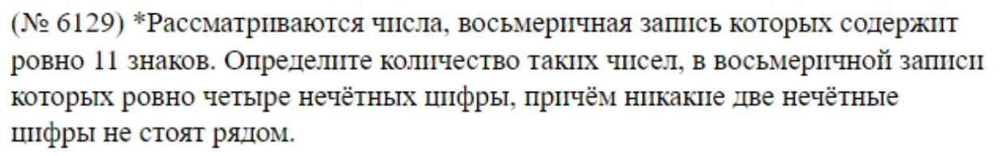

# Задание 8

## Правила

- Правило умножения
- Правило размещения
- Правило сочетания

	- для 2

a * b / 2!

	- для 3

a * b* c / 3!

	- для 4

a * b * c * d / 4!4

- Подсчет "от противного"

## Код

### Пример кода для повторяющихся

```
from itertools import *

sm = 0
for x in product("ЛТ", "ЛЕТО", "ЛЕТО", "ЛЕТО"):
    m = "".join(x)
    sm += 1

print(sm)
```

### Пример кода для неповторяющихся

```
from itertools import *

sm = 0

for x in permutations("КАЛИЙ"):
    m = "".join(x)
    if m[0] != "Й" and "ИА" not in m:
        sm += 1

print(sm)
```

### Пример кода для решения задач, где сказано про рядом идущие символы (Прием замены)

```
from itertools import *

sm = 0

for x in permutations("КОЛУН"):
    m = "".join(x)

    m = m.replace("Л", "К").replace("Н", "К")

    m = m.replace("У", "О")

    if "КК" not in m and "ОО" not in m:
        sm += 1

print(sm)
```


### Пример кода для уникальных комбинаций

```
from itertools import *

sm = 0

for x in set(permutations("АССАСИН")):
    m = "".join(x)
    sm += 1

print(sm)
```

### Пример кода для чисел

```
from itertools import *

sm = 0

for x in product("12345670", repeat=4):
    m = "".join(x)

    if m[0] in "246" and m[0] >= m[1] >= m[2] >= m[3]:
        sm += 1

print(sm)
```

### Пример кода для отсортированных комбинаций

```
from itertools import *

k = 0

for x in sorted(product("АКРУ", repeat=5)):
    m = "".join(x)
    k += 1

    if k == 150:
        print(m)
```

### Пример замены через цикл

```
from itertools import *

sm = 0

for x in product("ТИМАШЕВСК", repeat=5):
    m = "".join(x)

    for i in "ИАЕ": m = m.replace(i, "1")

    if "Ш1" not in m and "1Ш" not in m:
        for i in "ТМШВСК": m = m.replace(i, "0")

        if m.count("1") > m.count("0"):
            sm += 1

print(sm)
```

### Гибрид программного + ручного



```
from itertools import *

sm = 0

for x in product("01", repeat=11):
    m = "".join(x)

    if m.count("1") == 4 and "11" not in m:
        if m[0] == "0": sm += 3 * 4 ** 10
        else: sm += 4 ** 11 

print(sm)
```