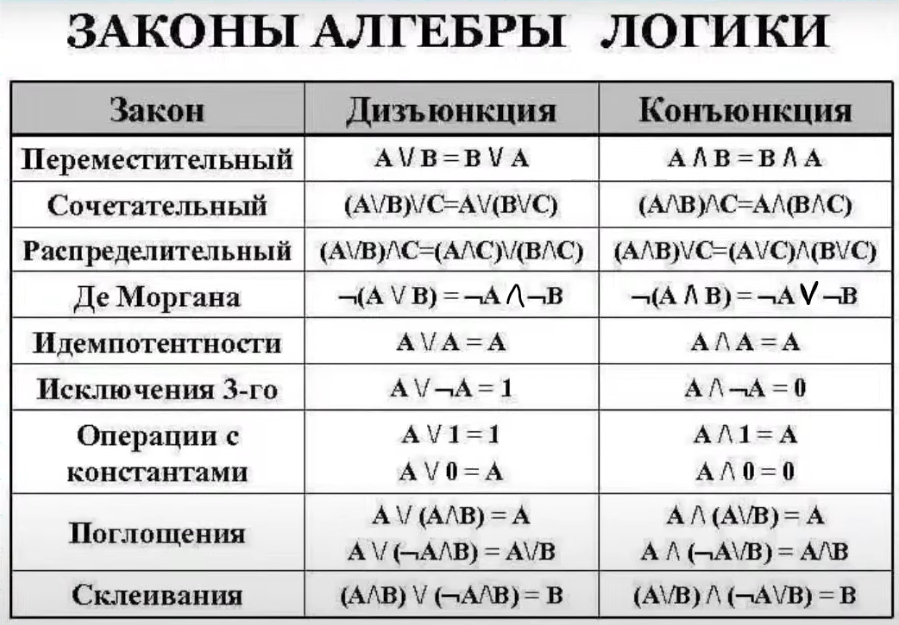

# Задание 15



## Виды задач

- Число
- Множество
- Отрезок


## Пример кода

```
from itertools import *

def f(x):
    P = 2 <= x <= 20
    Q = 15 <= x <= 25
    A = a1 <= x <= a2
    return ((not A) <= (not P)) or Q

Ox = [dx for x in (2, 15, 20, 25) for dx in (x, x + 0.1, x - 0.1)]
m = []

for a1, a2 in combinations(Ox, 2):
    if all(f(x) == 1 for x in Ox):
      m.append(a2 - a1)

print(min(m)) # 12.9 => ответ 13 тк выколотая засчитывается
```